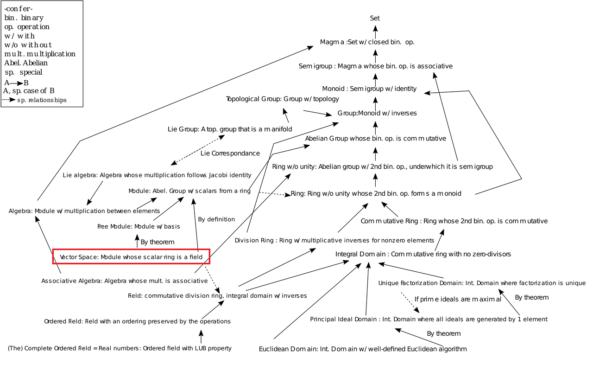

​	본 포스팅은 '프리드버그 선형대수학(5판)'을 공부하며 작성하였습니다.

​	흔히 벡터라고 하면 실수가 2~3개 모인 순서쌍을 떠올리곤 한다. 고등학교 수학에서 배우는 바로 그것 말이다. 이러한 실수의 순서쌍을 가지고 우리는 많은 연산을 하고 수많은 의미를 도출하였다. 그러나 벡터가 단지 숫자의 순서쌍을 벗어나 꽤나 다양한 것을 지칭할 수 있다면, 그리고 벡터라고 부르기로 한 다른 대상에서도 순서쌍으로써 도출한 의미를 적용할 수 있다면 상당히 놀라운 일일 것이다. 그리고 실제로 벡터는 실수의 순서쌍만을 지칭하지는 않는다.

​	들어가기에 앞서 '집합'과 '~공간'을 혼동하는 일이 없도록 하자. 단순히 여러 요소가 모이면 얼마든지 집합이라고 부를 수 있지만, 집합이 특별한 몇 가지 성질을 만족할때만 어떠한 공간이라고 부를 수 있다.

# 1. 벡터공간

​	다음으로는 벡터공간의 정의를 설명한다. 벡터공간을 일반화된 형태로 정의하는 이유는 가능한 많은 대상을 벡터로 분류하기 위해서이다. 이러한 성공적인 분류 이후에는 여러가지 수학적 대상을 벡터의 관점에서 동일하게 취급하고 연구할 수 있으며, 각 대상을 따로따로 연구하는 시간낭비를 피할 수 있다. 가령 수학적 대상인 A와 B가 각각 벡터공간으로 분류된다고 하자. A가 벡터공간으로서 어떠한 성질을 만족한다는 것을 알아내었다면, 당연히 B도 그러한 성질을 만족한다고 말할 수 있는 것이다. 수학에서는 (그리고 공학에서도) 두 대상이 어떠한 관점에서 같게 볼 수 있는 상황을 선호한다.

## 1.1. 벡터공간의 정의

> ​	*Definition.* **체(field)** $F$ 에서의 벡터공간(vector space) $V$ 는 다음 8가지 조건(VS1~VS8)을 만족하는 두 연산, 합과 스칼라 곱을 가지는 집합이다.
>
> ​	(1) **합(sum)**은 $V$ 의 두 원소 $x,\;y$ 에 대하여 유일한 원소 $x+y\in V$ 를 대응하는 연산이다. 이때 $x+y$ 는 $x$ 와 $y$ 의 합이라고 한다. 	(2) **스칼라 곱(scalar multiplication)**은 체 $F$ 의 원소 $a$ 와 벡터공간 $V$ 의 원소 $x$ 마다 유일한 원소 $ax\in V$ 를 대응하는 연산이다. 이때 $ax$ 는 $a$ 와 $x$ 의 스칼라 곱이라고 한다.
>
> ​	(VS1) 모든 $x,\;y\in V$ 에 대하여 $x+y=y+x$ 이다. 	(VS2) 모든 $x,\;y,\;z\in V$ 에 대하여 $(x+y)+z=x+(y+z)$ 이다. 	(VS3) 모든 $x\in V$ 에 대하여 $x+0=x$ 를 만족하는 $0\in V$ 이 존재한다. 	(VS4) 각 $x\in V$ 마다 $x+y=0$ 을 만족하는 $y\in V$ 가 존재한다. 	(VS5) 각 $x\in V$ 에 대하여 $1x=x$ 이다. 	(VS6) 모든 $a,\;b\in F$ 와 모든 $x\in V$ 에 대하여 $(ab)x=a(bx)$ 이다. 	(VS7) 모든 $a\in F$ 와 모든 $x,\;y\in V$ 에 대하여 $a(x+y)=ax+ay$ 이다. 	(VS8) 모든 $a,\;b\in F$ 와 모든 $x\in V$ 에 대하여 $(a+b)x=ax+bx$ 이다.
{: .prompt-warning }

​	위의 8가지 조건이 너무 뻔하고 당연한 조건으로 보여, 도대체 저걸 만족한다는게 무슨 의미가 있을까 하고 느껴질 수도 있다. 만약 당신이 이러한 생각이 들었다면, 수학 공부를 아주 성실하게 해왔다는 의미이다. 하지만 선형대수학을 공부할 때에는 그러한 생각은 잠시 내려놓고 객관적으로 바라보는 것이 좋다. 모든 수학적 대상을 늘어놓고 무작위로 하나를 뽑았을 때, 그 대상이 조건 VS1~VS8을 모두 만족할 확률은 아마도 거의 0에 가까울 것이다.

이미지 캡션

